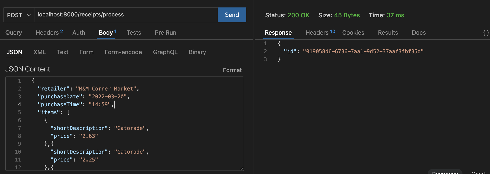
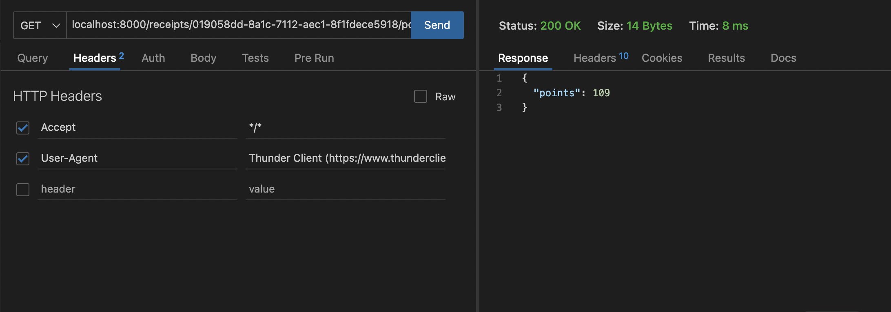

# Receipt Processor


# Setup


## Development
> This project was setup using Node.js v18.5. Please use specified version for best experience.

1. Install dependencies with ```npm install```
2. Start developoment server with ```npm run start```
3. Use .env.example file to customize port or it will run on default port:8000
4. For processing Receipts:
#### Endpoint: POST localhost:8000/receipts/process
#### Req Body:
{
  "retailer": "M&M Corner Market",
  "purchaseDate": "2022-03-20",
  "purchaseTime": "14:59",
  "items": [
    {
      "shortDescription": "Gatorade",
      "price": "2.63"
    },{
      "shortDescription": "Gatorade",
      "price": "2.25"
    },{
      "shortDescription": "Gatorade",
      "price": "2.25"
    },{
      "shortDescription": "Gatorade",
      "price": "2.25"
    }
  ],
  "total": "9.00"
}
#### Expected output - Receipt ID
#### 


5. For Getting Points:
#### Endpoint: GET localhost:8000/receipts/{id}/points
#### Response - {Points: <Points>}
#### 

6. Important files to look for
#### 1. src/middleware/validation.middleware.ts - Logic for receipt validity at the middleware level 
#### 2. src/controllers/receipt.controller.ts - Logic for point calculation and storage in memory

7. Run unit tests using ```npm run test```

